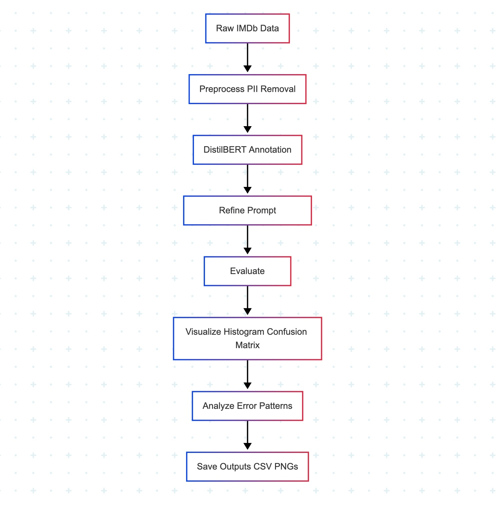

# AI Data Annotation Pipeline
 
## Overview
This repository hosts an AI Data Annotation Pipeline for sentiment analysis on movie reviews from the IMDb dataset. It leverages DistilBERT to predict positive or negative sentiment, preprocesses text to remove personally identifiable information (PII), refines low-confidence predictions via prompt engineering, and evaluates performance with detailed metrics and visualizations. The pipeline showcases natural language processing (NLP), ethical data handling, and model evaluation, ideal for AI training, research, or learning NLP workflows.
  
Key features:   
- **Preprocessing**: Removes PII using spaCy and Regex to ensure data privacy.    
- **Annotation**: Uses DistilBERT for sentiment classification.       
- **Prompt Engineering**: Refines predictions with confidence <0.95 to enhance accuracy.   
- **Evaluation**: Calculates class-specific and weighted precision, recall, and F1-score.     
- **Visualization**: Produces confidence histograms, confusion matrices, and accuracy bar plots.    
- **Error Analysis**: Identifies linguistic patterns in misclassified samples using bigrams.       

## Pipeline Diagram 
The following diagram outlines the pipeline’s workflow:  
  


## Repository Contents
The pipeline is organized within the `ai_data_annotation_pipeline` folder, containing:
- **`ai_data_annotation_pipeline.ipynb`**: Jupyter Notebook implementing the pipeline. It loads the IMDb dataset, preprocesses text, annotates sentiment, refines predictions, evaluates performance, and generates visualizations. Optimized for Google Colab’s free tier.
- **`walkthrough.txt`**: A detailed explanation of:
  - **Code Functionality**: Describes components like PII removal, annotation, and refinement.
  - **Design Choices**: Justifies ethical preprocessing and prompt engineering.
  - **Results Interpretation**: Analyzes metrics (F1=0.87) and error patterns (e.g., nuanced sentiments).
- **`accuracy_bar_plot.png`**: Bar plot comparing correct vs. incorrect predictions for original and refined models.
- **`annotated_imdb_outputs.csv`**: Processed dataset with original text, cleaned text, true labels, predictions, refined predictions, scores, and correctness flags.
- **`confidence_histogram.png`**: Histogram of confidence scores for refined predictions.
- **`confusion_matrix.png`**: Heatmap visualizing refined model performance.

## Results Summary
- **Dataset**: 1000 shuffled IMDb test samples (512 negative, 488 positive).
- **Original Model** (DistilBERT):
  - Negative: Precision=0.85, Recall=0.91, F1=0.88
  - Positive: Precision=0.90, Recall=0.83, F1=0.86
  - Weighted: Precision=0.87, Recall=0.87, F1=0.87
- **Refined Model** (Prompt Engineering at <0.95 confidence):
  - Negative: Precision=0.84, Recall=0.92, F1=0.88
  - Positive: Precision=0.90, Recall=0.82, F1=0.86
  - Weighted: Precision=0.87, Recall=0.87, F1=0.87
- **Insights**: Refinement corrects low-confidence errors, e.g., a positive review flipped from negative (confidence 0.8418 to 0.9781). Error analysis reveals challenges with nuanced or sarcastic sentiments, seen in bigrams like “entertaining film”.

## Setup Instructions
1. Open `ai_data_annotation_pipeline.ipynb` in Google Colab.
2. Install dependencies:
   ```bash
   !pip install --upgrade transformers pandas spacy scikit-learn matplotlib seaborn torch datasets fsspec torchvision tqdm
   !python -m spacy download en_core_web_sm
